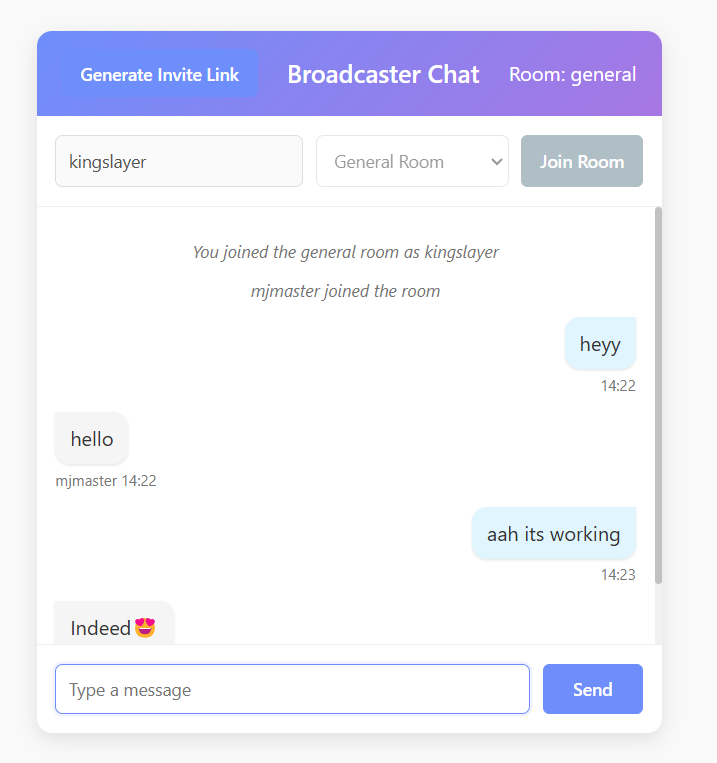
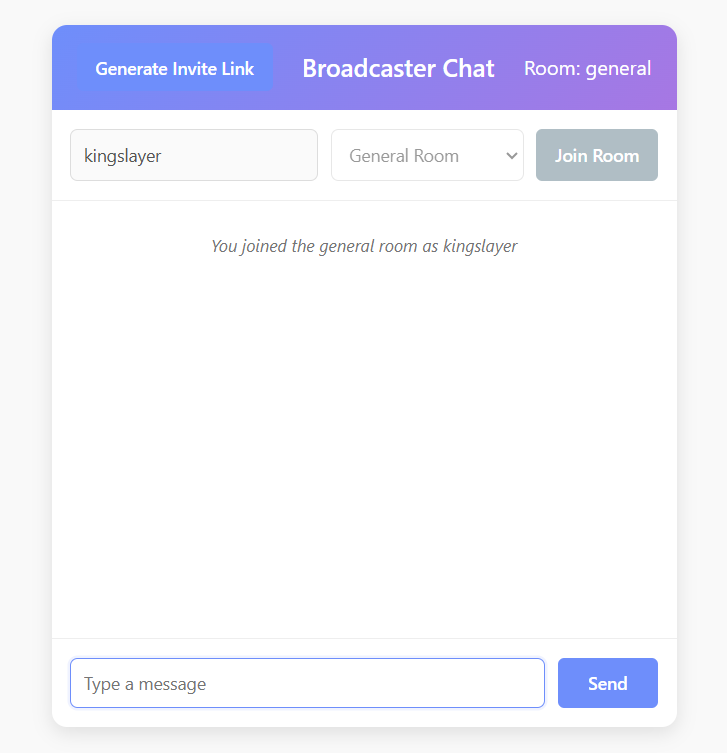
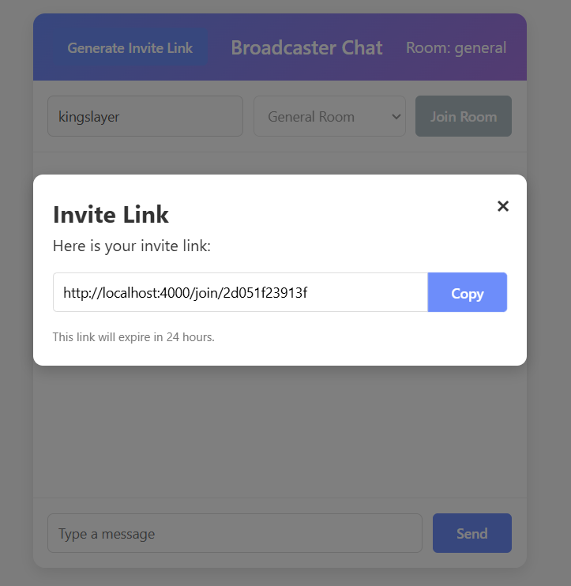
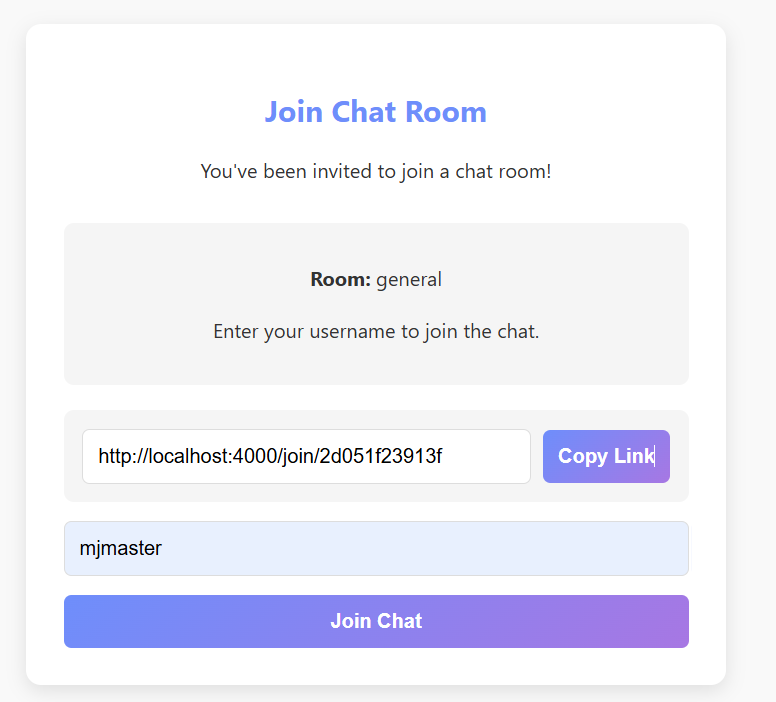

# A Real-time Chat App with Socket.IO

🚀 **Coming Soon: A Complete Tutorial!**

## Introduction

**Broadcaster Chat** is a modern, real-time messaging platform built with **Node.js, Express, and Socket.IO**. It allows users to join different chat rooms and communicate instantly with a sleek and interactive UI. 

### 🌟 Key Highlights:
✅ **Room-based conversations** for topic-specific discussions  
✅ **Instant messaging** powered by Socket.IO  
✅ **Typing indicators** to know when someone is responding  
✅ **Invite links** to seamlessly share rooms  
✅ **User notifications** for join/leave events  
✅ **Fully responsive design** for mobile & desktop  
✅ **Smooth animations** for an engaging experience  



---

## 📸 Screenshots


| Dashboard| invite|
|------------|-----------|
|  |  |

| session | output |
|------------|-----------|
|  |  |

## 🚀 How It Works

Broadcaster Chat follows a **client-server** architecture:

1. **Backend (Server)**: 
   - Built with **Node.js** and **Express** to handle HTTP requests.
   - Uses **Socket.IO** for real-time communication.
2. **Frontend (Client)**: 
   - Designed with **HTML, CSS, and JavaScript** for a smooth, interactive UI.
3. **Message Flow**:
   - Users join a chat room ➡️ Send messages ➡️ Messages broadcast instantly using Socket.IO.

---

## 🛠️ Setup Guide

### 🔹 Prerequisites
- **Node.js** (v14 or higher)
- **npm** (v6 or higher)

### 🔹 Installation Steps

1️⃣ **Clone the Repository**
   ```bash
   git clone https://github.com/kingslayer458/A-Real-time-Chat-App-with-Socket.IO.git
   cd A-Real-time-Chat-App-with-Socket.IO
   ```

2️⃣ **Install Dependencies**
   ```bash
   npm install
   ```
   ```
   npm init -y
   ```
   ```
   npm install express socket.io
   ```

### 🔹 Configuration

- Set up the **server port** in `server.js` by modifying:
   ```javascript
   const PORT = 4000; // Change as needed
   ```
- Update the **Socket.IO connection URL** in `index.html`:
   ```javascript
   const socket = io("http://your-server-ip:4000");
    ```
    ```
   http://your cureent ip_address:4000 --->for android and linux
   ```

### 🔹 Running the Application

1️⃣ **Start the server**
   ```bash
   node server.js
   ```

2️⃣ **Access the App**
   Open your browser and go to:
   ```
   http://localhost:4000
   ```

---

## 💡 Using Broadcaster Chat

### 🎯 **Join a Room**
🔹 Enter your username  
🔹 Select a chat room  
🔹 Click **Join Room**

### ✨ **Send Messages**
🔹 Type in the input box  
🔹 Press **Enter** or click **Send**

### 🔗 **Invite Others**
🔹 Click **Generate Invite Link**  
🔹 Share the link with friends!

---
---

## 🔧 Troubleshooting

❌ **Chat not working?**
- Ensure the **Socket.IO URL** matches your server address.
- Check for any **console errors** in the browser.

❌ **Invite links not working?**
- Make sure your server is **publicly accessible** if sharing externally.

---

## 🚀 Future Enhancements

🔹 **User authentication** for secure login  
🔹 **Message history storage** to save conversations  
🔹 **File sharing** for sending images & documents  
🔹 **Custom room creation** by users  
🔹 **Emoji support** for fun interactions  
🔹 **Read receipts** to track seen messages  

---

## 🤝 Contributing

We welcome contributions! Submit a **Pull Request** to improve the app.

---

## 📜 License

This project is licensed under the **MIT License**. See the `LICENSE` file for details.

💙 Happy Coding & Enjoy Chatting! 🎉


